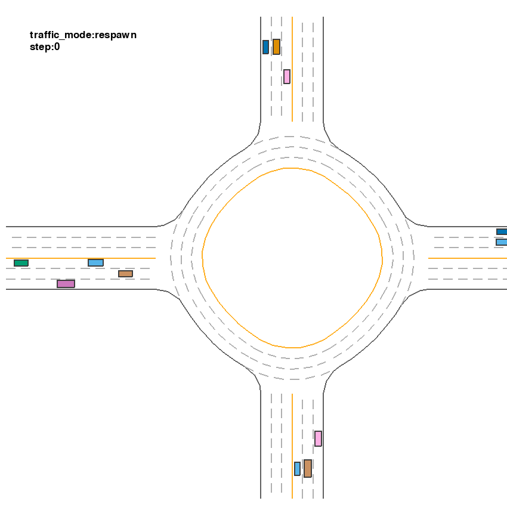

安装指令：

```sh
python -m venv .venv
source .venv/bin/activate

pip config set global.index-url https://mirrors.tuna.tsinghua.edu.cn/pypi/web/simple
python -m pip install --upgrade pip
pip install -e .
pip install custom/torch-2.5.0+cu121-cp311-cp311-linux_x86_64.whl
pip install casadi swanlab multiprocess
```

这是一个在MetaDrive上的二次开发库，原项目的github网址为：<br />
[https://github.com/metadriverse/metadrive](https://github.com/metadriverse/metadrive)


训练日志位置：`results/log_2025_12_30_21_20_27/`，其中包含了两个文件夹：`cbf_ratio.txt`和`record.txt`。

`cbf_ratio.txt`记录了全局cbf的干预率，以及每个rollout桶收集数据中cbf干预值的统计量，例如中位数、均值、上$\alpha$分位点之类的；<br />
`record.txt`记录了诸如训练参数、训练过程中奖励变化等，可以较为清晰地看到训练中发生了什么。

该版本的训练情况如图：<br />
